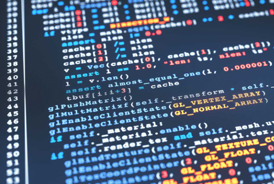

## Introduction

My passion for software engineering came from a deep interest in technology and its possibility to solve real-world problems. From a young age, I have been drawn to how games were created and how they worked. Over time, this interest has grown into a strong dedication to mastering the skills necessary to build efficient and impactful software solutions. Whether it’s working on algorithms for distributing resources in a network or developing a student information system, I find it useful to learn about creating systems that are not only functional but also able to make a difference.

## Algorithms and Data Structures

One of the key areas where I want to deepen my knowledge is algorithms and data structures. These are important parts of software engineering, and understanding them is crucial for developing programs. For example, when working on my social media networks project, I realized the importance of selecting the right data structures to handle datasets. Additionally, writing clean, maintainable code is an important part of software engineering, and I want to continue improving in this area. I have learned the importance of following practices, such as using design patterns, testing my code, and writing clear documentation. These practices not only make my code easier to understand but also contribute to the overall quality of the program. By enhancing my skills in these areas, I hope to create software that is efficient and functional.

## Cybersecurity, AI, and AR

Beyond the core areas of software engineering, I am very interested in cybersecurity, artificial intelligence (AI), and augmented reality (AR). Cybersecurity is important because it protects data, systems, and networks from growing online threats. I find it exciting to learn how AI can help make cybersecurity better, like finding threats faster and responding to them automatically. I’m also fascinated by how AR can create new experiences, like making training tools or helping people understand data through interactive visuals. By learning about these technologies, I hope to build creative and secure solutions that make a difference in the tech world.

## Looking Ahead

Overall, my goal is to become a flexible software engineer who can take on a wide range of challenges. I believe that continuous learning is important in this field, and I am dedicated to informing myself with the latest developments in technology. Whether it’s mastering a new programming language, learning a new framework, or exploring a new area of technology, I am always hoping to expand my knowledge and skills.
better. While this way of learning may not suit everyone, I believe it will work for me as I continue to improve my skills in TypeScript and other programming languages.
