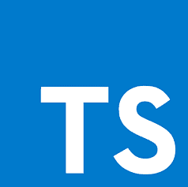

## Introduction

Learning TypeScript has been a different experience for me, especially since I’ve worked with other programming languages like Python, Java, and C++. TypeScript offers a unique approach to coding, combining the flexibility of JavaScript with the structure of languages that use static typing.

## My Thoughts On TypeScript

When I first started working with TypeScript, I was curious about how it built on top of JavaScript. At first, the type annotations seemed a bit scary, especially since JavaScript's dynamic typing let me focus on getting things done without worrying much about data types. But as I got more used to TypeScript, I began to understand how static typing helps catch mistakes early. Finding errors before running the code has made a big difference, giving me more confidence in the programs I write, especially in complex projects where finding bugs can take a lot of time. 
One of the most valuable parts of learning TypeScript has been how it has helped me better understand modern JavaScript, especially the ES6 features. For example, using features like destructuring and arrow functions in TypeScript requires more thought due to types, which has improved how I approach them.

## TypeScript Compared To Other Languages

Compared to other languages, TypeScript feels like a mix of JavaScript’s simplicity and C++’s structure. It reminds me of when I first learned C++, where you have to think carefully about data types and memory management. However, unlike C++, TypeScript doesn’t require as much manual work, making it easier to use.

```
// JavaScript
let name = "John Doe"; // No type annotation
name = 6; // No error, dynamic typing

// TypeScript
let name: string = "John Doe"; // Type annotation
name = 6; // Error: Type 'number' is not assignable to type 'string'
```

## From A Software Engineering Perspective

From a software engineering perspective, I can see why TypeScript is becoming used more. It encourages better coding practices by making you think about data types and how they work together in your application. This leads to code that’s easier to maintain and less likely to have errors, which is important in larger projects. However, I also see that TypeScript can add some extra work, especially when it comes to writing and keeping up with type definitions. 

## My Thoughts On Athletic Software Engineering

As for athletic software engineering, the practice WODs have been really helpful for me. At first, the idea of timed exercises was a bit scary because I’m not used to coding under time pressure, so it felt stressful. But after doing a few WODs, I started to see the importance of them. They push you to think fast and apply what you’ve learned in a high-pressure environment, which is a useful skill, especially when facing real-world coding problems.
The WODs have helped me improve not just my speed in coding but also my ability to think quickly and solve problems under pressure. This is a different way of learning than I’m used to, but I find it helpful. While this style of learning can be intense, I think it goes well with more traditional methods by adding some real-world pressure.

## Looking Ahead

Overall, I believe TypeScript is a strong programming language, especially for larger and more complex projects where keeping code well-organized and error-free is important. The WODs have been a helpful tool in reinforcing what I’ve learned and pushing me to get better. While this way of learning may not suit everyone, I believe it will work for me as I continue to improve my skills in TypeScript and other programming languages.
