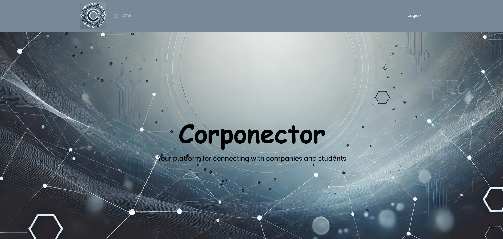

## What is Corponector?

Corponector is an innovative web application dedicated to creating meaningful connections between talented UH students and forward-thinking companies. It provides a dynamic platform that simplifies the process of discovering career opportunities, networking with industry professionals, and building successful futures. Designed to enhance the visibility of job and internship postings, Corponector enables companies to showcase detailed profiles, highlight potential roles, and specify the skills they seek in candidates. Meanwhile, students can create personalized profiles showcasing their interests, skills, and career aspirations, making it easier to find opportunities tailored to their goals.

Corponector goes beyond job listings by offering intelligent matching functionality, helping students and employers find the right fit based on shared interests and requirements. Additionally, it empowers administrators with tools to manage site content, add new skill and location categories, and ensure a secure, well-organized platform. Dedicated to empowering students to launch their careers and helping companies discover top talent, Corponector is more than a recruitment tool, but it is also a collaborative hub for innovation, professional growth, and success.

## What was my role?

In the Corponector project, my role involved designing and implementing key features to ensure an engaging user experience. I created a welcoming landing page that effectively communicates the platform's mission and captivates users at first glance, providing a clear and easy entry point into the application. Additionally, I developed intuitive and user-friendly forms for students and companies to input and manage their profiles, ensuring data accuracy, ease of use, and a smooth registration process. My team also worked with Vercel and PostgreSQL to design and query the database, enabling efficient retrieval and management of data within the application, such as job postings, student profiles, and company details. This included setting up relational tables and creating queries to match students with job opportunities based on their skills and interests. Furthermore, I collaborated with other team members to make sure the platform's features were put together, tested, and aligned with the overall project goals. My contributions helped build a functional, and visually appealing platform that connects students with employers, streamlines recruitment, and supports career development.

## What did I learn?

Through my work on the Corponector project, I gained valuable hands-on experience in both front-end and back-end development. I enhanced my skills in React by creating dynamic and interactive user interfaces, while also improving my understanding of Next.js for building efficient full-stack applications. I learned how to design and implement forms that gather and manage data effectively, ensuring a smooth user experience. Working with PostgreSQL deepened my knowledge of database design, including creating relational tables and writing complex queries to retrieve and manage data, such as matching students with job opportunities based on their skills. Additionally, I learned how to integrate front-end and back-end components, ensuring seamless data flow and functionality within the application. This project also taught me the importance of collaboration, as I worked with team members to make sure our features aligned with project goals and provided a user-friendly platform.

Source: <a href="https://github.com/corponector"><i class="large github icon "></i>abuted/corponector</a>
